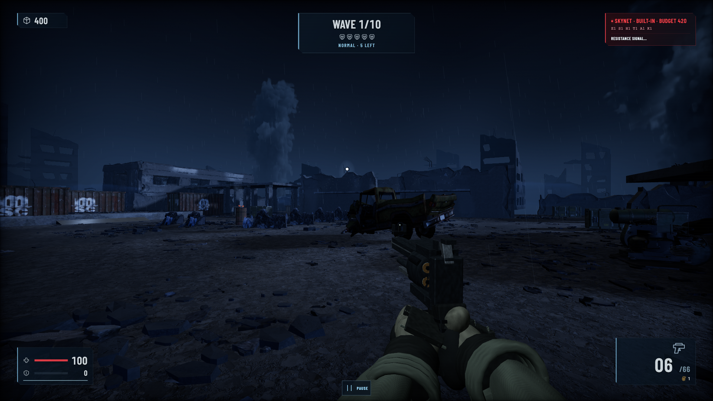
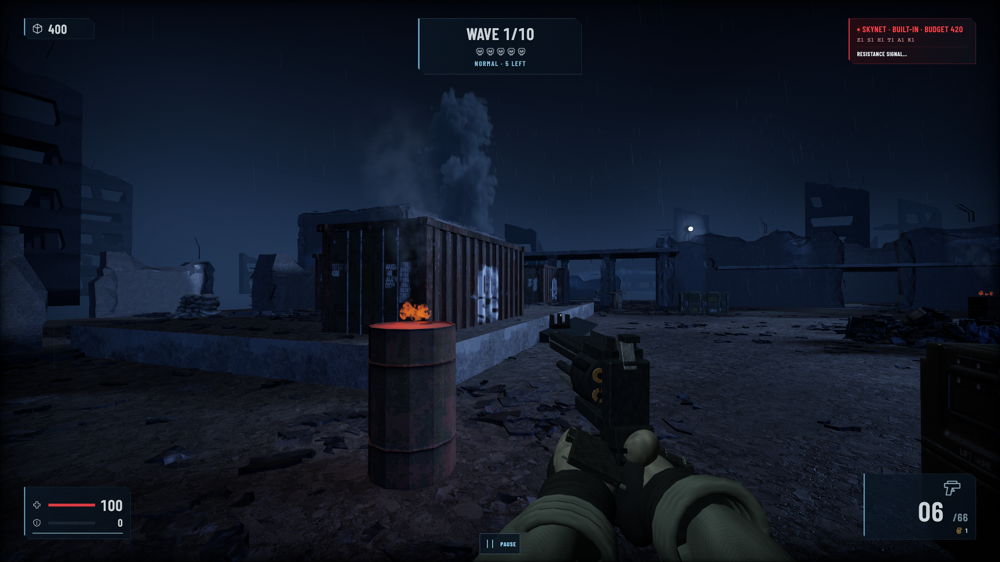
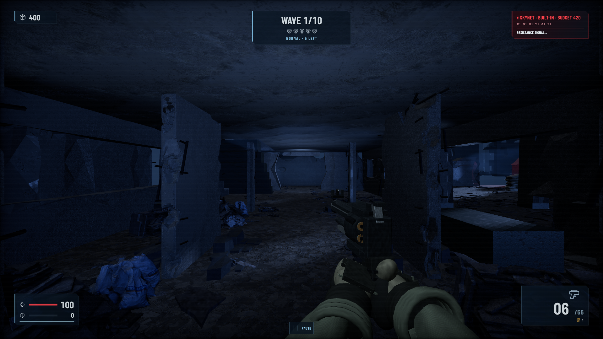
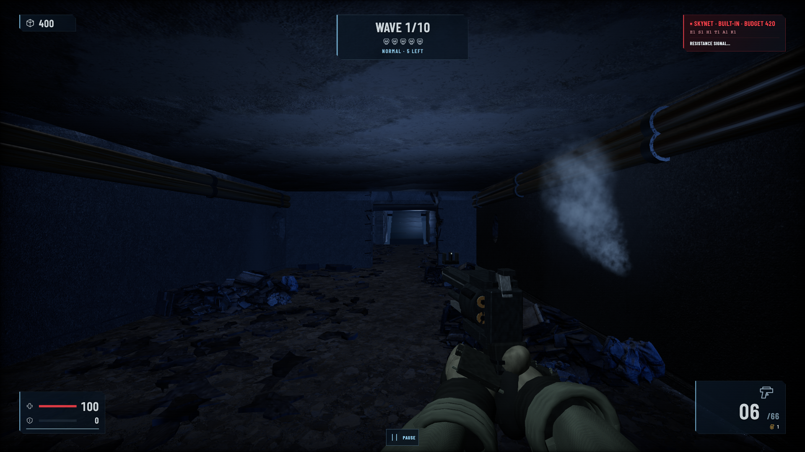
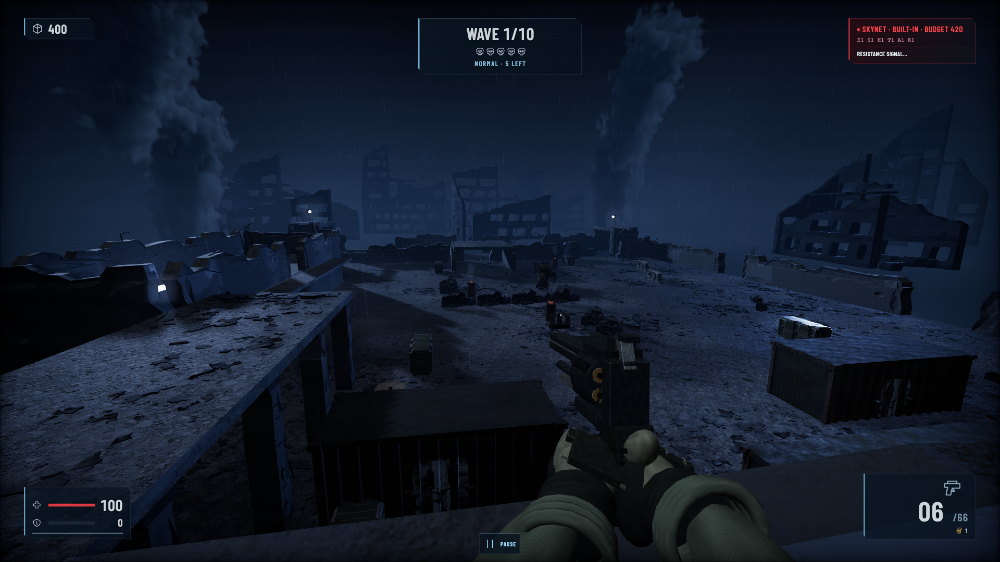

# Terminator: Human vs Skynet

Defend Bunker 7 against waves of Skynet machines in a Future War FPS. Fight solo or with two friends against an evolving AI director.

[Play in your browser](https://terminator.app.blitz.dev/) · [Scene development journal](https://terminator-v2-scene-journal.app.teenyapp.com/)











## Local scenes

Install the linked Kite3D rewrite and open the Bunker 7 main scene:

```sh
cd /Users/minjunes/games/terminator
npm install
npx kite3d dev --no-open
```

Open the URL printed by the command and press Run. Add `&weapon=revolver-rebuild` to that URL to opt into the rebuilt revolver without changing the normal pistol loadout.

The gun range is stored separately at `assets/weapons-lab.scene.gltf`. With the editor stopped, open that file from **Project files**, then press Run. The range selects `revolver-rebuild` automatically and exposes its nine animation clips through the range controls. To return to the game, open `assets/main.scene.gltf` from **Project files**.
