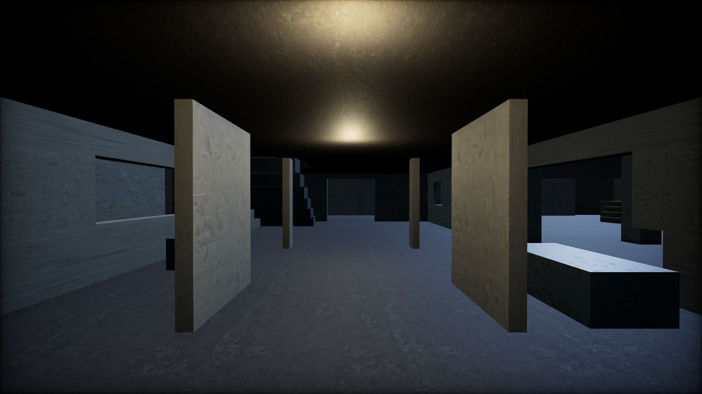
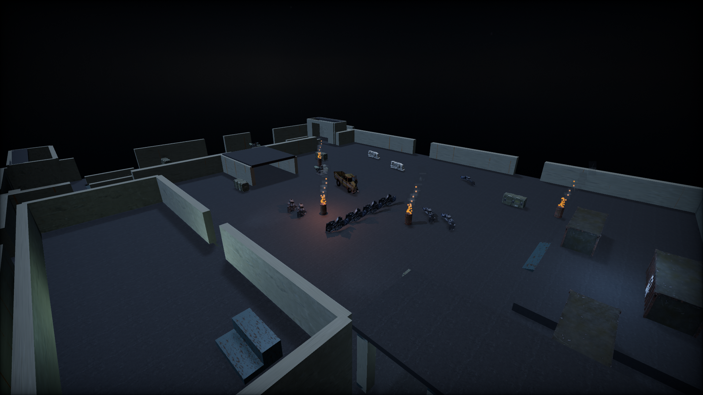

# Selected scene asset imports

The selected Hangar Concrete Floor is installed across all 14 floor models (15 scene placements). Its local 1K diffuse, OpenGL normal, and packed AO/roughness/metalness maps use a consistent two-meter tile scale and neutral concrete tint. Scene IDs, transforms, geometry, colliders, and material names are preserved.

Eight selected prop sources are also installed across 13 model assets and 33 placements: rubble, wrecked truck, barrel, shipping container, cargo crate, sandbags, generator, and cable spool. Textures are resized to at most 1K; individual pack variants are selected and fitted to the original collider extents. Original node names, transforms, and extras remain stable anchors. Long rubble banks use repeated piles.

Play batching now distinguishes texture transforms and retains vertex colors and extra UV channels. Slabs retain the same tile scale in the editor and during gameplay, and imported vertex-colored models retain their appearance. Rebuilding map assets reapplies the selected floor automatically.





## Remaining imports

This is a partial integration. Of 25 unique selected Sketchfab sources, eight are installed, seven are downloaded but need surface or dynamic-part adaptation, and ten still need download. The authenticated batch reached HTTP 429 after 15 successful downloads. Existing models remain active for pending families.

The downloaded wall, flank wall, bunk, trader console, door, shutter, and grate still need fitting/adaptation. In particular, the door is supplied open, the bed includes suspension lines, and animated shutters and breakable wall chunks must retain their gameplay behavior.

`assets/sources/selected-assets.json` records the chosen sources, authors, licenses, target asset IDs, and pending status. The Heavy shares the selected Endo body; both HK variants share one selected vehicle set. The comparison and chosen-set pages remain under `docs/asset-comparison/`.

Keep the selected worn military-industrial direction: concrete gray, gunmetal, faded olive, localized rust, and restrained red warning lights and optics.

## Reproduce the floor import

```sh
npm run assets:selected:fetch
npm run assets:selected:apply-floor
```

The fetcher uses Poly Haven's official API, checks its MD5 checksums, and records SHA-256 hashes and attribution in `assets/sources/hangar-concrete-floor.json`. Committed maps allow normal development and builds without provider access.

## Acquire remaining models

Configure `SKETCHFAB_API_TOKEN` in the local environment, then run:

```sh
npm run assets:selected:fetch-models
```

The command uses the official Sketchfab download API and stores archives in the Git-ignored `.kite3d/selected-downloads/` folder. It deduplicates shared source models, verifies saved archives against their SHA-256 receipts and skips them on reruns. New requests are paced five seconds apart. HTTP 429 honors `Retry-After`; waits of up to 60 seconds retry automatically up to three times. Longer cooldowns print the server reset time and exit with completed downloads preserved. Without a server reset time, retries use bounded backoff and any suggested retry time is labeled as such. Credentials and signed download URLs are not written to receipts. This command downloads archives only; it does not install them into the scene.

After download, inspect each archive's license and resources, fit the meshes to existing scene bounds, and adapt articulated parts to the existing rigs and gameplay animation names. Preserve the stable authored IDs and collision geometry. Add the included model attribution to `assets/LICENSES.md`, then validate the scene before marking those imports complete.

## Reproduce the prop import

```sh
npm run assets:selected:prepare-props
npm run assets:selected:apply-props
```

Preparation needs the downloaded archives and Python Pillow (also used by existing texture build tools). It selects static variants, omits showcase animations, resizes textures, and retains original archive credits and hash receipts in `assets/models/selected/`. Committed prepared assets allow normal map builds without Sketchfab credentials or the download cache. `npm run build:map-assets` reapplies both the selected floor and prepared prop imports.

Applying props again skips an already imported target. After changing fit rules, regenerate the map assets to reapply them from their procedural base; review any manually edited map models before doing so.

## Validation

- `npx kite3d doctor`: all checks pass.
- `NODE_OPTIONS="--require=./tools/check-headless-metal.cjs" npx kite3d check`: Playable, Editable, and Persisted pass using the repository's existing Mac renderer helper. The default headless renderer timed out on this machine.
- Full `npm test`: 237/238 pass while Chrome validation ran concurrently. The simulation throughput benchmark failed under that load; rerunning `node --test test/core/sim/sim.test.js` alone passes all six tests.
- All 12 targeted tests pass: download resume/backoff, verified prop resources and bounds, authored collision behavior, floor resources, material batching, vertex colors and extra UV channels.
- With the prop imports, the CLI editor-hosted check timed out (HTTP 409). A dedicated Chrome/Metal session running the same Kite3D `headless=check&frames=30` page passed Playable, Editable, and Persisted with zero runtime errors and clean Stop cleanup. Static runtime batches increased from 19 to 32.
- Editor inspection finds all 15 floor placements with loaded maps and the expected repeat scale; no browser errors.
- Runtime captures at four map viewpoints show no browser errors or missing PBR maps.

The selected rubble, barrel, and sandbag sources provide color textures with scalar roughness rather than separate normal/roughness maps. Their supplied material appearance is retained; other imported prop PBR maps are included. The runtime overview was recaptured after the vertex-color fix with no browser errors.
